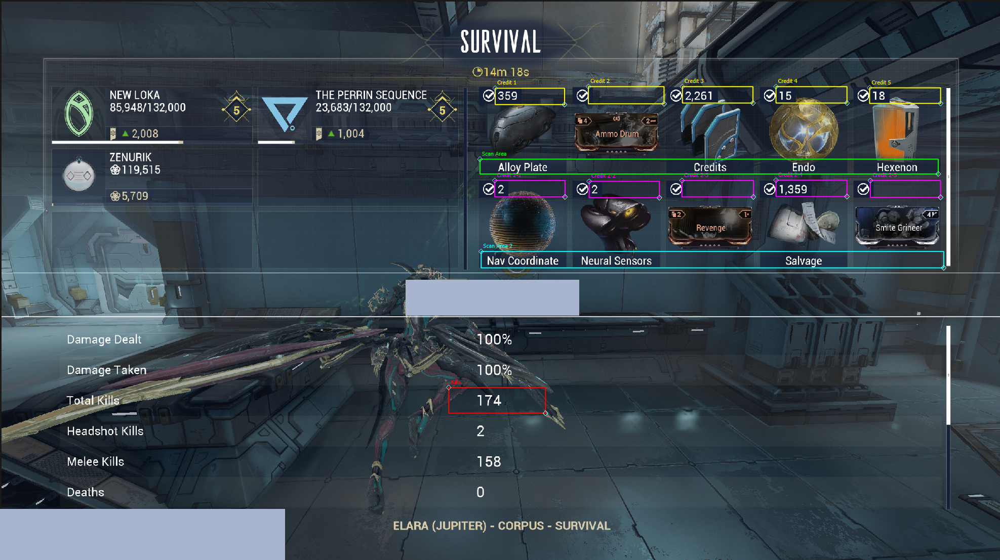

# Warframe Lecta Tracker (CPM/KPM/OCR)

A Python-based overlay and tracker for Warframe that monitors Credits Per Minute (CPM), Kills Per Minute (KPM), Enemy Data  using Optical Character Recognition and EE.log reading.

## Features
- **Live Overlay:** Draggable stats (Credits,CPM, current ammount of alive enemies, KPM, FPS) over the game.
- **Real-time Graphs:** Visualizes your farming efficiency.
- **OCR Tracking:** Reads credits/kills from the Mission Progress screen (Tab).
- **Enemy Tracking** Reads how many enemies are currently alive from ``EE.log``.
- **FPS Tracker:** Uses PresentMon for an FPS plot.
- **Live PB comparing** uploading a run that will plot live along your data to see how much better/worse you perform.
- **Acolyte Warner:** Flashes a warning on-screen when an Acolyte is about to spawn, showing its name and a countdown.
- **Effigy Replace Warner** When Effigy dissapeares (dead or no energy) a warning will be flashed to replace it.

---

## Example
<a href="https://www.youtube.com/watch?v=" target="_blank">
  
</a>

*Click the image above to watch the demo video.*


## How to Download & Run

### Option 1: Embeddable folder for easy use
**Python and packages are embedded within**
1. Go to the Releases page.
2. Download the latest `.zip` file.
3. Extract it anywhere.
4. Run `Start_Tracker.bat`.

### Option 2: Source Code
If you have Python installed and want to run the raw scripts/edit the code yourself:

1. Clone this repository or download the Source Code zip.
2. Install dependencies:
   ```bash
   pip install -r requirements.txt
   ```
3. Run the launcher:
   ```bash
   Start_Tracker.bat
   ```
   *(Or run `python CPM_OOP.py` directly)*

## Loading your Configurations into a new Version
* I am regulary releasing new versions. To prevent that you have to complete the entire Setup (bounding box, folder selection, ect.) you have the option to load previous configurations via a button in the UI. To get there:
```text
First time setup detected...
Launching Bounding Box Setup...

--- Bounding Box Setup ---
Is this for Solo or Duo setup? [s/d]: s
Draw Scan Area (Roster) [y/n]: n

Setup complete.
```
* Alternatively you can copy all `.json`, `.png` from the old release under `python_and_required_packages\\LECTA_SCRIPTS` and insert them in the new release (same path).
* I will provide `bbox_config_solo.json` and `bbox_config_duo.json` to the Source if new users want to simply load in configs and drag boxes arround instead of following the Setup Guide. The boxes in the Editor are labeled `Scan Area 1/2` and `Credits 1 4` or `Credits 2 1` indicating where each box belongs.


---

## Controls
| Key | Action |
| :--- | :--- |
| **F8** | Start Run Timer |
| **TAB** | Scan Credits (Open Mission Progress) |
| **F9** | Toggle Bounding Box Overlay |
| **F10** | Save Data & End Run |

## First Time Setup
1. When you first launch the tracker, it will ask you to select a folder to save your run data. In that Folder you will find data of the run `master_run_log.csv` and plots
2. It will then launch the **Bounding Box Setup**.
3. Follow the on-screen instructions to draw boxes around the "Credits" text and the 5 possible credit values in the Mission Progress screen.

* Example Bounding boxes:


## Requirements
- Warframe must be running on the **Primary Monitor**.
- Interface Scale in Warframe should be consistent (default 100 recommended).
- **PresentMon.exe** must be in the folder for FPS tracking.
  - *Note:* This project uses **PresentMon v1.6.0** (Legacy). Newer versions of Intel PresentMon have changed their output format and command-line arguments, which are not compatible with this tracker's parsing logic. The correct version is included in the release.


## General Notes and Feature explenation
* `EE.log` is only read from, no injection is happening. You can uncheck that box and the script will not read the data.
* The Acolyte Warner relies on reading `EE.log` to detect specific pre-spawn log entries. It can identify Violence, Mania, Torment, and Malice by name. For Misery and Angst, it provides a generic "Acolyte" warning due to ambiguous log data.
* Tracking the FPS requires `PresentMon.exe` to be run as Administrator hence you will be asked to rerun as Administrator.
* You can load already recorded runs (`master_run_log.csv`) from yourself or others into the tracker, this will add plots when you start so you can compare yourself to another Run (e.g. your own PB). You have the option to either let the PB run plot itself along with your data (recommended for readability and visability) or you can plot the entire PB plot and just have your current run plot live. Either way the `run_plots.png` and `enemy_plots.png` will include both runs across your recorded time window.
